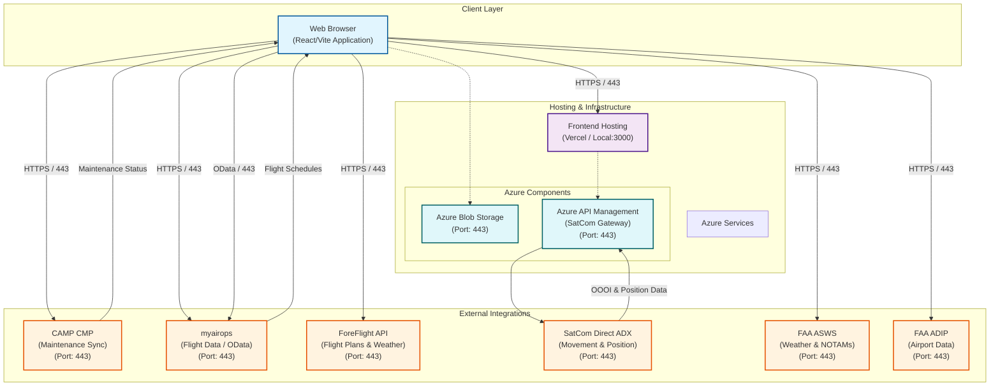

# Technical Architecture Diagram

## System Components

### 1. Client Layer
- **Web Application**: React 18, Vite, TypeScript.
- **Port**: 3000 (Local Development), 443 (Production).

### 2. Hosting & Infrastructure
- **Frontend**: Hosted on Vercel (or similar static hose).
- **Azure Integration**:
  - **Azure Blob Storage**: Used for scalable file and document storage (Port 443).
  - **Azure API Management (APIM)**: Secure gateway for SatCom Direct integration (Port 443).

### 3. External Integrations
- **CAMP CMP**: 
  - Protocol: HTTPS
  - Port: 443
  - Purpose: Synchronizing maintenance status, due lists, and work orders.
- **myairops**: 
  - Protocol: OData / HTTPS
  - Port: 443
  - Purpose: Fetching flight schedules, crew assignments, and aircraft availability.
- **SatCom Direct**: 
  - Via Azure APIM
  - Purpose: Real-time aircraft movement (OOOI) and position updates.
- **ForeFlight**: 
  - Protocol: HTTPS
  - Port: 443
  - Purpose: Flight planning, filing, and weather data.
- **FAA ASWS & ADIP**: 
  - Protocol: HTTPS
  - Port: 443
  - Purpose: US government aviation data and airport facility directories.
